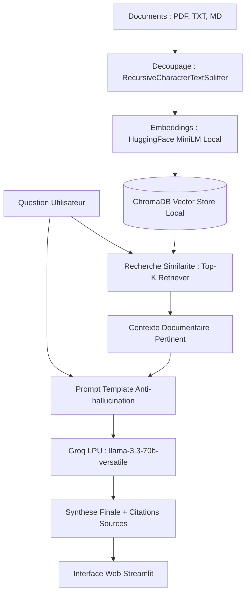

# AskMyDocs — Assistant RAG Documentaire (Groq & Llama 3)

Système de **Retrieval-Augmented Generation (RAG)** haute performance développé en Python avec **LangChain**, **ChromaDB**, **Groq (Llama 3.3 70B)** et des **Embeddings multilingues HuggingFace**.

---

## 1. Fonctionnalités Clés

- **Inférence Haute Vitesse** : Traitement accéléré via l'infrastructure Groq LPU (`llama-3.3-70b-versatile`).
- **Embeddings Multilingues Locaux** : Modèle `sentence-transformers/paraphrase-multilingual-MiniLM-L12-v2` pour une indexation sémantique en français et en anglais sans latence réseau ni coût API.
- **Ingestion Multi-formats** : Prise en charge native des fichiers `.pdf`, `.txt` et `.md`.
- **Base Vectorielle Persistante** : Stockage et recherche de similarité top-k avec **ChromaDB**.
- **Contrôle d'Hallucination** : Structuration de prompts stricts limitant les réponses au contexte documentaire fourni.
- **Traçabilité Complète** : Identification et affichage des sources, des fichiers et des extraits de texte exploités.
- **Interface Web Streamlit** : Tableau de bord interactif avec upload dynamique de documents et historique de conversation.

---

## 2. Architecture Technique



---

## 3. Installation et Lancement

### Étape 1 : Installation des dépendances
```bash
pip install -r requirements.txt
```

### Étape 2 : Configuration de la clé API
Renseignez votre clé API Groq dans le fichier `.env` :
```env
GROQ_API_KEY=gsk_...
```

### Étape 3 : Démarrage du serveur
```bash
streamlit run app.py
```
Accédez à l'application via votre navigateur à l'adresse locale : `http://localhost:8501`.

---

## 4. Organisation du Projet

```
AskMyDocs/
├── data/
│   ├── documents/               # Corpus documentaire source (PDF, TXT, MD)
│   └── chroma_db/               # Base de données vectorielle persistante
├── src/
│   ├── __init__.py
│   ├── config.py                # Paramètres globaux (modèles, chunking, chemins)
│   └── rag_engine.py            # Logique RAG (Ingestion, Split, Index, Retrieval, QA)
├── app.py                       # Interface utilisateur Streamlit
├── requirements.txt             # Dépendances du projet
├── .env                         # Clé API et variables locales
├── .gitignore                   # Exclusion des fichiers sensibles et temporaires
└── README.md                    # Documentation technique
```
